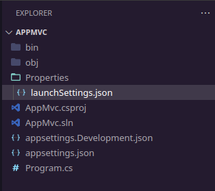

# App MVC .NET

## Criando um projeto MVC

Para iniciar uma aplicação web vazia, digite o comando abaixo.

```shell
dotnet new web -n AppWeb
```

O para parâmetro `-n` é utilizado para dar nome ao projeto que esta sendo criado.
Ao final da execução você terá os seguintes arquivos criados, conforme imagem abaixo.



Para iniciarmos a criação da estrutura do `MVC` criaremos os seguintes diretórios: `Controllers`, `Models` e `Views`.

```shell
mkdir Controllers Models Views
```

Agora no arquivo `Program.cs` iremos adicionar os `middlewares` necessários para a estrutura do `MVC` funcione corretamente.

Esta é a visão atual do arquivo .

```C#
var builder = WebApplication.CreateBuilder(args);
var app = builder.Build();

app.MapGet("/", () => "Hello World!");

app.Run();
```

Arquivo após a adição dos `middlewares`.

```C#
var builder = WebApplication.CreateBuilder(args);

builder.Services.AddControllersWithViews();

var app = builder.Build();

app.UseRouting();

app.MapControllerRoute(
    name: "default",
    pattern: "{controller=Home}/{action=Index}/{id?}"
);

app.Run();
```

Agora iremos criar nosso `controller`, criaremos o arquivo `HomeController.cs` com o conteúdo.

```C#
using Microsoft.AspNetCore.Mvc;

namespace AppMvc.Controllers;

public class HomeController : Controller
{
    public IActionResult Index()
    {
        return View();
    }
}
```

Logo e seguida cria e `View` responsável por retorna a `Index` deste `controller`, que será criada no diretório `View/Home/Index.cshtml`

```cshtml
Hello World!
```

## Adicionando ferramentas de Front-End

Antes de prosseguirmos é necessário instalarmos uma `lib` para nos auxiliar na adição de `plugins` ao projeto, esta ferramenta é a `libman`.

Para instalar execute o comando, isso irá realizar a instalação global da lib:

```shell
dotnet tool install -g Microsoft.Web.LibraryManager.Cli
```

Para criar o arquivo `libman.json`, na raiz do projeto execute o comando e escolha a `defaultProvider` padrão que irá utilizar. Neste caso vou utilizar o valor default `cdnjs`:

```shell
libman init
```

Antes de instalar a `libs` que iremos utilizar no front-end do projeto criaremos os diretórios que irão armazenar estes arquivos.

```shell
mkdir -p wwwroot/{css,js,lib}
```

O próximo passo é instalarmos a `libs` referentes ao `jquery`, `bootstrap` e `jquery-validation-unobtrusive`.

Instalando o `jquery`.

```shell
libman install jquery@3.7.1 --destination wwwroot/lib/jquery
```

Instalando o `bootstrap`

```shell
libman install bootstrap@5.3.3 --destination wwwroot/lib/bootstrap
```

Instalando o `jquery-validation-unobtrusive`

```shell
libman install jquery-validation-unobtrusive@4.0.0 --destination wwwroot/lib/jquery-validation-unobtrusive
```

Para que a inclusão deste arquivos estaticos funcionem corretamente é necessário adicionarmos no arquivo `Program.cs` o trecho abaixo, que será responsável pelo carregamento destes arquivos.

```C#
// ...

var app = builder.Build();

app.UseStaticFiles();

// ...
```
